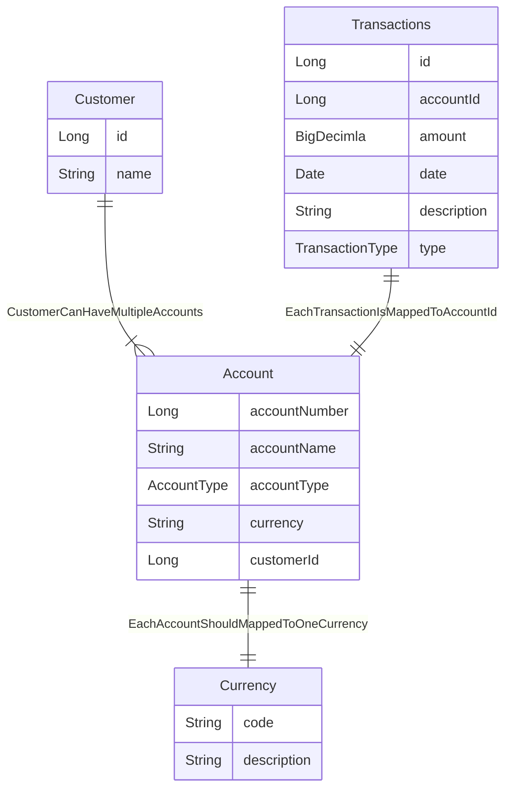

### h2 database connection details:

        jdbc:h2:mem:testdb 
        username : admin
        password:  admin < for local only >  - need to store username/password securely in the server or system like vault or equivalent.

### Scripts

        Load sample data in  to view the response on your local, execute the commands inside insert.sql in h2 database

### swagger url :

    use the below URL to test the rest endpoint
    sample : customer id : 1001
             Account id :  2001
    
    http://localhost:9191/swagger-ui/index.html#/account-controller
    
    Sample request :

        Account     : http://localhost:9191/api/v1/{customerId}/accounts
                    : http://localhost:9191/api/v1/1001/accounts
        
            Success Response :
                        `[
                            {
                            "accountNumber": 2003,
                            "accountName": "1001-CHEQUE",
                            "accountType": "CHEQUE",
                            "balanceDate": "2023-02-26",
                            "currency": "JPY",
                            "balance": 0
                            },
                            {
                            "accountNumber": 2001,
                            "accountName": "1001-SAVINGS",
                            "accountType": "SAVINGS",
                            "balanceDate": "2023-02-26",
                            "currency": "AUD",
                            "balance": 1000
                            }
                         ]
            
            Error Response :
                         {
                            "errorMessage": "Couldn't find any accounts for the user 100122",
                            "errorCode": 404
                          }`

        Transactions: http://localhost:9191/api/v1/{customerId}/accounts/{accountId}/transactions
                    : http://localhost:9191/api/v1/1000/accounts/2001/transactions

        
        SuccessReponse :
                        [
                            {
                            "accountId": 2001,
                            "date": "2023-02-22",
                            "amount": -2000,
                            "description": "TEST DESC",
                            "transactionType": "DEBIT",
                            "accountName": "1001-SAVINGS",
                            "currency": "AUD"
                            },
                            {
                            "accountId": 2001,
                            "date": "2023-02-14",
                            "amount": 1000,
                            "description": "TEST DESC",
                            "transactionType": "CREDIT",
                            "accountName": "1001-SAVINGS",
                            "currency": "AUD"
                            }
                        ]

        Error Response :
    
                        {
                            "errorMessage": "Couldn't find any transactions for the account 2001",
                            "errorCode": 404
                        }

#### Table relationship diagram

### Description

    Table 'Customer' :
        - Stores list of customers
        - Can have multiple accounts 
    
    Table 'Account'
        - Stores list of accounts mapped to customer Id
    
    Table 'Currency'
        - Stores list of currency for the accounts
    
    Table 'Transactions'
        - Stores list of transactions mapped to an account Id

    Index 'idx_account'
        - Index created on account table for CUSTOMER_ID

    Index 'idx_account_transaction'
        - Index created on TRANSACTION table for ACCOUNT_ID

