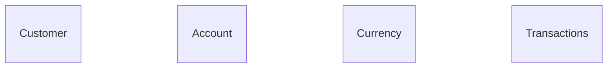

### h2 database connection details:

        jdbc:h2:mem:testdb 
        username : admin
        password:  admin

### Scripts

    to load sample data to view the response , execute the commands inside insert.sql in h2 database

### swagger url :

    use the below URL to test the rest endpoint
    sample : customer id : 1001
             Account id :  2001
    http://localhost:9191/swagger-ui/index.html#/account-controller

#### ER diagram

