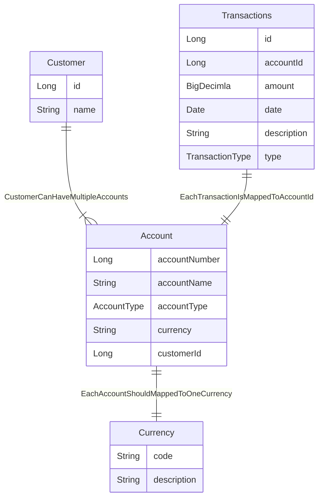

### h2 database connection details:

        jdbc:h2:mem:testdb 
        username : admin
        password:  admin < for local only >  - need to store username/password securely in the server or system like vault or equivalent.

### Scripts

    to load sample data to view the response , execute the commands inside insert.sql in h2 database

### swagger url :

    use the below URL to test the rest endpoint
    sample : customer id : 1001
             Account id :  2001
    http://localhost:9191/swagger-ui/index.html#/account-controller
    
    Sample request 
        Account     : http://localhost:9191/api/v1/{customerId}/accounts
                    : http://localhost:9191/api/v1/1001/accounts

        Transactions: http://localhost:9191/api/v1/{customerId}/accounts/{accountId}/transactions
                    : http://localhost:9191/api/v1/1000/accounts/2001/transactions

#### Table relationship diagram

